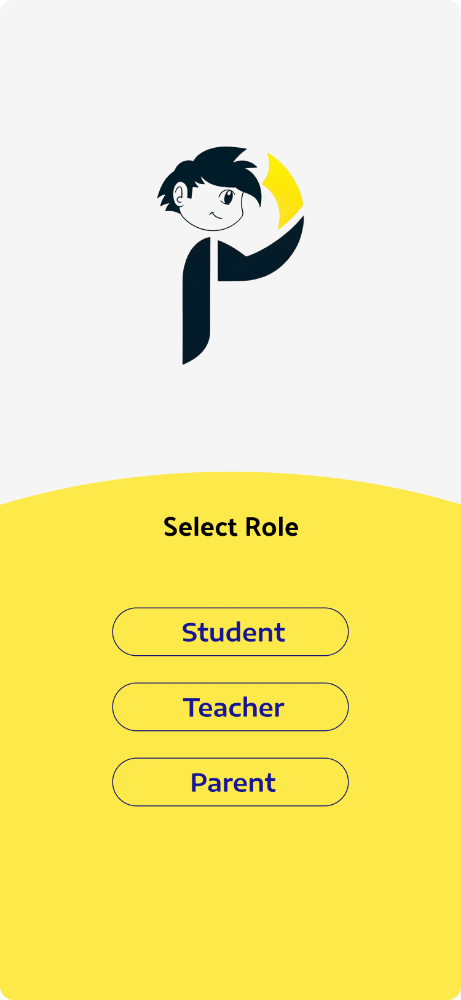

# Presentza - Android Attendance Management System

## Overview

Presentza is an Android application designed to streamline attendance management. Built with Java and Firebase, the app provides a seamless and efficient way to track and manage attendance records in real-time. It's an ideal solution for educational institutions and businesses looking to automate their attendance processes.

## Table of Contents

- [Features](#features)
- [Screenshots](#screenshots)
- [Tools and Technologies](#tools-and-technologies)
- [Usage](#usage)
- [Contact](#contact)

## Features

- **User Authentication**: Secure login and registration using Firebase Authentication.
- **Real-time Database**: Attendance data is stored and retrieved in real-time with Firebase Realtime Database.
- **Attendance Tracking**: Mark attendance with a single tap and view records instantly
- **Dashboard**: View summarized attendance statistics and reports.

## Screenshots

## Tools and Technologies

## Usage

1. Launch the app on your Android device.
2. Register a new account or log in with existing credentials.
3. Teachers add lecture using the button provided.
4. Students mark attendance usi ng the OTP of the teacher.
5. View attendance records and statistics on the dashboard.

## Contact

For any queries or feedback, please reach out to us at:

- **Name**: Vikhnesh Vijaykumar Pillai
- **Email**: [vikhneshvijay11@gmail.com](mailto:vikhneshvijay11@gmail.com)
- **Phone**: [9537560289](tel:+919537560289)

  
